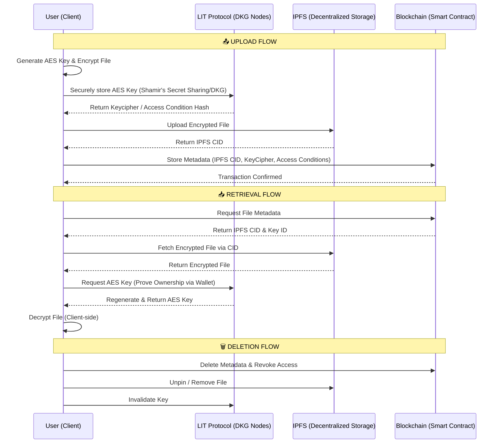

# 📜 The Chronicle

The Chronicle is a comprehensive, secure, and decentralized application built to handle sensitive data with cutting-edge blockchain security, hybrid encryption, and automated security mechanisms. Designed with a rich and interactive Next.js frontend, The Chronicle provides an end-to-end secure vault for file storage and web3 interactions.

---

## 🌟 Decentralized Vault End-to-End Workflow

The core of The Chronicle is its **Decentralized Vault**. Here is the exact flow of how data is securely managed:

1. **Key Generation & Encryption:** The user generates a symmetric AES key locally, which is used to encrypt the file payload.
2. **Key Storage (LIT Protocol):** The AES key is securely stored using the **LIT Protocol**, which utilizes a Distributed Key Generation (DKG) concept, similar to Shamir's Secret Sharing. The key is never stored in a single centralized location.
3. **Decentralized Storage (IPFS):** The encrypted file is uploaded directly to public **IPFS**. It is not stored in a single place; instead, it is distributed across multiple nodes, ensuring high availability and censorship resistance.
4. **Blockchain Metadata:** The file's metadata, along with its IPFS CID (Content Identifier), is securely anchored on the blockchain. This guarantees immutable security. The user has complete control—no external entity can corrupt or access the data because everything is encrypted.
5. **Data Retrieval & Decryption:** When a user wants to read or open their file, the system fetches the CID from the blockchain. The symmetric key is securely regenerated via the LIT network (after verifying access conditions), and the file is symmetrically decrypted on the client side.
6. **Data Deletion:** If a user chooses to delete their file, the metadata is erased from the blockchain, and the IPFS pin is removed. The access conditions on the LIT protocol are revoked, rendering the key completely useless forever.

### 🏛️ Infrastructure Architecture (Decentralized Vault)



---

## 🚀 Core Features

### 🔐 Hybrid Encryption (The Main Security Core)
The Chronicle uses a powerful hybrid encryption mechanism:
- Combines the speed of symmetric encryption (for large files) with the security of asymmetric encryption (for securing the symmetric keys).
- Ensures **Zero-Knowledge Architecture** where the server never sees the raw data or the private keys.

### ⛓️ Blockchain Security & Web3 Interactions
- Deeply integrated with **Lit Protocol** and **Ethers.js / Viem** for decentralized access control.
- Enforces cryptographic access conditions.
- Uses smart contracts (`VaultABI`) to manage state, ownership, and permission policies securely on-chain.

### 📂 IPFS File Upload & Retrieval
- Decentralized storage ensures high availability and tamper-proofing.
- Users can effortlessly upload sensitive documents to the Vault.
- Fast and reliable file retrieval that pieces together the IPFS CID with the decryption logic.

### 🛡️ Security Scanning & Cron-Jobs
- Automated backend **Cron-jobs** that run periodically to perform security scans.
- Ensures data integrity, monitors unauthorized access attempts, and checks the health of the decentralized nodes.

### 💻 The Frontend Experience
Built with **Next.js 15 (App Router)**, the frontend is dynamic, responsive, and incredibly user-friendly:
- **Dashboard & Vault:** A visually stunning dashboard (`Dashboard.jsx`, `Vault.jsx`) built with **TailwindCSS**, **Radix UI**, and **Framer Motion** for smooth micro-animations.
- **Data Visualization:** Uses **Recharts** and **React Circular Progressbar** to display security metrics, vault usage, and scan results intuitively.
- **Theme Support:** Fully supports dark mode (`next-themes`) for a premium aesthetic.
- **Real-time Feedback:** Uses `sonner` for toast notifications and `lucide-react` for beautiful iconography.

---

## 🛠️ Tech Stack

**Frontend:**
- [Next.js (App Router)](https://nextjs.org/)
- React 19
- NextAuth.js for authentication (Google, GitHub, traditional email/password)
- TailwindCSS v4
- Framer Motion & Radix UI
- Recharts

**Backend & Security:**
- Node.js (Next.js API Routes)
- Mongoose (MongoDB)
- bcrypt, jsonwebtoken, speakeasy (2FA)

**Web3 & Decentralization:**
- Ethers.js & Viem
- Lit Protocol (`@lit-protocol/auth`, `@lit-protocol/lit-client`)
- IPFS (InterPlanetary File System)

---

## 📁 Project Structure Overview

```text
The-Chronicle/
├── app/                  # Next.js App Router (Pages, Layouts, API Routes)
│   ├── api/              # Backend endpoints
│   ├── (auth)/           # Authentication flows
│   └── home/             # Main application views
├── components/           # Reusable UI Components
│   ├── Dashboard.jsx     # Main user dashboard
│   ├── Vault.jsx         # Secure file management interface
│   ├── auth/             # Authentication components
│   └── web3/             # Blockchain specific components
├── server/               # Server-side logic and providers
├── services/             # Core business logic
│   ├── VaultABI.js       # Smart contract ABI
│   ├── blockchain.js     # Web3 interaction service
│   └── encryption.js     # Hybrid encryption logic
├── public/               # Static assets
└── package.json          # Project dependencies
```

---

## 🏁 Getting Started

First, install the dependencies:

```bash
npm install
# or
yarn install
# or
pnpm install
```

Configure your environment variables by setting up the `.env` file (refer to `.env.example` if available).

Run the development server:

```bash
npm run dev
# or
yarn dev
# or
pnpm dev
```

Open [http://localhost:3000](http://localhost:3000) with your browser to see the application in action.
